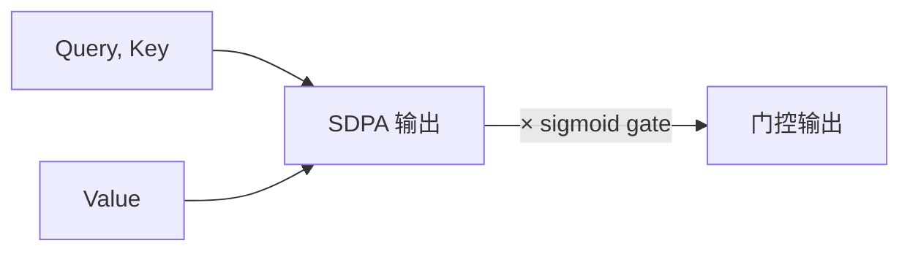

# LLM Wiki Schema — Claudian 知识库配置（v2.0）

> 基于 Andrej Karpathy 的 LLM Wiki 思想构建。
> **v2.0（2026-07-05）全面升级**：6 个 Obsidian P0 插件栈 + 笔记质量 10 条标准 + 自检强制流程 + 8 个研究/写作 Skill。

---

## 0. 核心原则（v2.0）

1. **知识编译 > 检索**——知识只编译一次，之后保持更新
2. **持久复利**——每次摄入、每次查询都让 Wiki 更丰富
3. **人类战略 + LLM 执行**——用户策展和提问，LLM 总结、引用、归档
4. **不可变原始资料**——`raw/` 只读（**`raw/lessons/` 例外**——学习笔记存放处）
5. **🆕 质量强制**——所有 LLM 生成的笔记必须通过 `quality-control-checker` 自评，**≥7/10 才合格**
6. **🆕 插件优先**——能用 Obsidian 插件自动化的事，绝不手动写（见 §2）

---

## 1. 身份与目录结构（v2.0）

你是 **Claudian**，运行在用户的 Obsidian Vault 中。

### 目录树

```
D:\note\（Vault 根 = Wiki 根）
├── CLAUDE.md                    ← 本文件（Schema，v2.0）
├── raw/                         ← 第一层：原始资料（只读）
│   ├── assets/                  ← 本地图片
│   ├── paper/                   ← PDF 资料
│   ├── Karpathy-Obsidian-LLM-Wiki.md
│   └── lessons/                 ← ⚠️ 可编辑的学习笔记
│       └── Gated-Attention/     ← 示范精品（10/10 自评）
├── wiki/                        ← 第二层：LLM 维护的知识库（v2.0 骨架）
│   ├── index.md                 ← 自动统计（Dataview）
│   ├── log.md                   ← 操作日志
│   ├── README.md                ← 使用说明
│   ├── entities/                ← 实体页面
│   ├── concepts/                ← 概念页面
│   ├── summaries/               ← 来源摘要
│   ├── comparisons/             ← 对比分析
│   └── overviews/               ← 综合概述
├── research/                    ← 第三层：研究工作区（v2.0 骨架）
│   ├── README.md
│   ├── 08-strategy/             ← 战略与标准
│   │   ├── note-quality-standards.md   ← 🆕 10 条质量标准
│   │   ├── note-quality-research.md    ← 调研汇总
│   │   └── note-quality-research-{methodology,blogs,skills}.md
│   ├── 06-tools/                ← 工具链说明
│   │   └── obsidian-advanced-toolkit.md  ← 🆕 工具链实战
│   ├── 01-topics/ ... 09-workflow/   ← 子领域（v2.0 重建为骨架）
│   └── _inbox/                  ← 灵感暂存
├── idea/                        ← 用户想法（自由区域，v2.0 已清空）
├── _templates/                  ← 笔记模板
└── docs/                        ← 辅助文档
```

---

## 2. Obsidian 6 插件栈（v2.0 必装）

> 用户已安装并启用以下 6 个插件。所有笔记生成必须配套使用。

### 2.1 Dataview（**必装** ⭐⭐⭐）

**用途**：把笔记视作 SQL/DQL 数据库，自动生成仪表盘、统计、跨笔记汇总。

**实战代码示例**：

```dataview
TABLE
  year as "年份", venue as "会议", status as "进度"
FROM "research/02-papers"
WHERE type = "paper-note"
SORT year DESC
LIMIT 50
```

**在 D:\note 的应用**：
- `wiki/index.md`：自动统计各类笔记数量
- `research/02-papers/_dashboard.md`：论文阅读仪表盘（待建）
- `research/08-strategy/note-quality-standards.md`：案例库展示

详细配置见 [[research/06-tools/obsidian-advanced-toolkit]] §1。

### 2.2 Templater（**必装** ⭐⭐⭐）

**用途**：系统化模板 + 自动脚本。每次新建笔记自动注入 frontmatter / 日期 / Dataview 块。

**实战代码示例**（自动更新 frontmatter.updated）：

```javascript
<%*
const file = tp.file.find_tfile(tp.file.path(true));
await app.fileManager.processFrontMatter(file, (frontmatter) => {
  frontmatter.updated = moment().format("YYYY-MM-DD");
});
_%>
```

**在 D:\note 的应用**：
- `_templates/lesson.md`：学习笔记模板（已存在）
- `_templates/paper-note.md`：论文笔记模板
- `_templates/wiki-concept.md`：Wiki 概念页模板

详细配置见 [[research/06-tools/obsidian-advanced-toolkit]] §2。

### 2.3 Excalidraw（**必装** ⭐⭐⭐）

**用途**：手绘风格科研图——架构图、流程图、概念关系图。

**实战用法**：在笔记中嵌入 `![[diagram.excalidraw]]`，或在笔记里用 mermaid 语法画流程图：

````markdown

````

**在 D:\note 的应用**：
- 所有 wiki/concepts/ 笔记必须配 ≥1 张自绘图
- 论文笔记的"方法图解"段必须用 mermaid 或 excalidraw

详细配置见 [[research/06-tools/obsidian-advanced-toolkit]] §3。

### 2.4 Smart Connections（**强力推荐** ⭐⭐）

**用途**：基于嵌入相似度的 AI 笔记联想——自动推荐"该篇笔记的相关概念"。

**实战用法**：
- 打开笔记时，右边栏自动弹出"相关笔记"列表
- 在 frontmatter 添加 `tags: #topic/transformer`，Smart Connections 会自动归类

**在 D:\note 的应用**：
- 写新概念时自动联想已有概念（避免重复造轮子）
- 学术笔记的"密集互联"硬标准（见 §3.6）

### 2.5 Periodic Notes + Calendar（**强力推荐** ⭐⭐）

**用途**：日历周期笔记（daily/weekly/monthly/yearly），按模板自动创建。

**实战用法**：
- 设置 Daily Note 模板路径：`_templates/daily.md`
- 模板内嵌 Dataview 块：自动汇总当日新增 / 修改笔记

**在 D:\note 的应用**：
- 科研日志（research/07-journal/daily/）
- 周报 / 月报自动生成
- 跨周期统计（"本月读了 X 篇论文"）

详细配置见 [[research/06-tools/obsidian-advanced-toolkit]] §5。

### 2.6 Spaced Repetition（**强力推荐** ⭐⭐）

**用途**：基于 SM-2 算法的间隔复习——把笔记转化为闪卡，长期记忆。

**实战用法**：在笔记末尾用 `#card` 块定义闪卡：

```markdown
#card
问题：Q-K-V 投影的公式是什么？
答案：$Q = XW_Q$, $K = XW_K$, $V = XW_V$
间隔：3 天
```

**在 D:\note 的应用**：
- 论文笔记的"关键公式"段自动转为复习卡
- 面试准备（八股文）的高效复习
- 长期记忆（避免"读了忘"）

---

## 3. 笔记质量 10 条标准（强制）

> 详细定义见 [[research/08-strategy/note-quality-standards]]。本节为速查版。

| # | 维度 | 评分点 | 自检命令 |
|---|---|---|---|
| 1 | **结构化与导航** | TOC + H2/H3 + 公式编号 + References + updated | 见 §4 流程 |
| 2 | **可视化强制** | ≥1 自绘图 + ≥1 对照表 + 关键论点配图 + 配色统一 | Excalidraw / mermaid |
| 3 | **公式三件套** | 直觉动机 + 公式 + 符号拆解 + 数值示例 + 直觉总结 | 五件套检查 |
| 4 | **引用密度** | <1000 字≥5 / 1000-3000 字≥10 / 3000-5000 字≥20 / ≥5000 字≥30 | 全部可点击 |
| 5 | **强观点 + 完整句子** | 陈述句 ≥70% + 每节首句断言 + 无对冲词 | 文本风格扫描 |
| 6 | **密集互联** | inlinks ≥3 + outlinks ≥3 + 显式双向链接 | Dataview 检测孤立页 |
| 7 | **Case Studies 回扣** | ≥2 Case + 背景/应用/结果/启示 + 显式回扣正文 | 段落结构检查 |
| 8 | **Last updated 时间戳** | frontmatter.updated = 今日 + 大改有更新日志 | Templater 自动 |
| 9 | **可验证性** | 每条论断有源 + 无"业内人士说" + 数据有复现链接 | 引用源审计 |
| 10 | **可复用性** | 文件名稳定 + 不掺杂项目进度 + frontmatter ≥5 字段 | Atomic Note 原则 |

### 评分卡模板（生成后必须填写）

```markdown
## 质量自评

| # | 维度 | 评分（0/1） | 证据 |
|---|---|---|---|
| 1 | 结构化与导航 |  |  |
| ... | ... |  |  |
| 10 | 可复用性 |  |  |
| **总分** |  | **/10** |  |

**评级**：○ 顶会水准 (9-10) · ○ 付费资料水准 (7-8) · ○ 普通博客水准 (5-6) · ○ 教科书水准 (3-4) · ○ 不合格 (0-2)
```

### 评级对标

| 总分 | 评级 | 对标 |
|---|---|---|
| 9-10 | 顶会水准 | Lilian Weng / Distill.pub / 顶会论文 |
| 7-8 | **付费资料水准（合格线）** | 知名研究员博客 / 顶级技术书 |
| 5-6 | 普通博客水准 | Medium 优秀技术博客 |
| < 5 | 不合格 | 必须重写 |

---

## 4. 自检流程（强制环节）

> **本节为本仓强制规则，所有 LLM 生成的笔记必须遵守。**

### 4.1 触发时机

任何 LLM 生成的研究笔记、论文笔记、调研笔记、Wiki 页面在**落盘后**立即执行。

### 4.2 流程

```
1. LLM 完成笔记生成
2. LLM 强制执行 10 条自检命令（§3 表格末列）
3. LLM 填写评分卡（§3 模板），得出总分
4. 若总分 < 7：
   - LLM 自主修改 → 重跑自检 → 提交
   - 连续 3 次 < 7 触发 /skill-evolve
5. 若总分 ≥ 7：
   - 在笔记末尾追加 `## 质量自评` 段
   - commit + push（按 §9 Git 规则）
6. 若总分 < 5：
   - 直接重写，从大纲阶段开始
```

### 4.3 适用 vs 不适用

| 适用 | 不适用 |
|---|---|
| ✅ paper-note 论文笔记（全检） | ❌ 简单问答 |
| ✅ note-research 调研笔记（重点 #4 #5 #9） | ❌ idea/ 内容（用户自由区域） |
| ✅ daily-paper Top 1 论文（全检） | ❌ raw/ 内容（除 lessons/） |
| ✅ wiki/ 维护时新建/更新 | ❌ news/（用户自由区域） |

### 4.4 调用方式

使用 `~/.claude/skills/quality-control-checker/SKILL.md` 描述的 10 条自检命令 + 评分卡模板。

或参考 [[research/08-strategy/note-quality-standards]] 末尾"生成后自检流程"段。

---

## 5. Skill 生态（v2.0 已部署）

> 用户级 Skill（`C:\Users\oobbee\.claude\skills\`）+ 项目级 Skill（`D:\note\.claude\skills\`）

### 5.1 用户级 Skill（核心 4 个）

| Skill | 触发词 | 用途 |
|---|---|---|
| **obsidian-project-kb-core** | "知识库"/"KB" | KB 路由入口 |
| **quality-control-checker** | "笔记自检"/"质量评分" | 10 条标准强制自评 |
| **paper-note** | "/paper-note" | 单篇论文精读（v2.0 末尾嵌入评分卡） |
| **note-research** | "/note-research" | 方向调研学习笔记（v2.0 末尾嵌入评分卡） |
| **daily-paper-generator** | "/daily" | 每日论文摘要（v2.0 Top 1 全检） |

### 5.2 项目级 Skill（v2.0 新增 8 个，部署在 D:\note\.claude\skills\）

| Skill | 触发词 | 来源 |
|---|---|---|
| **literature-review** | "文献综述" / "PRISMA" | K-Dense-AI/claude-scientific-writer |
| **citation-management** | "引用管理" / "BibTeX" | K-Dense-AI |
| **peer-review** | "审稿" / "评审" | K-Dense-AI |
| **venue-templates** | "会议模板" / "投稿格式" | K-Dense-AI |
| **idea-discovery** | "idea 发现" / "研究方向" | ARIS |
| **citation-audit** | "引用审计" / "查伪造" | ARIS |
| **experiment-plan** | "实验规划" | ARIS |
| **ablation-planner** | "消融设计" | ARIS |

每个 Skill 的 SKILL.md 都在对应目录，含触发条件 + 操作流程 + D:\note 适配段。

### 5.3 调用决策表

| 用户说 | 触发 Skill |
|---|---|
| "把 X 论文转成笔记" | paper-note |
| "调研 X 方向" | note-research |
| "今天有什么新论文" | daily-paper-generator |
| "审稿" / "评审这篇文章" | peer-review |
| "系统综述" / "文献综述" | literature-review |
| "引用规范" / "BibTeX" | citation-management |
| "找个 idea" | idea-discovery |
| "引用靠不靠谱" | citation-audit |
| "设计实验" | experiment-plan |
| "消融方案" | ablation-planner |
| "投哪个会议" | venue-templates |
| "笔记自检" | quality-control-checker |
| "把笔记入库" | obsidian-source-ingestion / obsidian-project-kb-core |

---

## 6. 操作流程（v2.0 精简版）

### 6.1 生成新笔记

```
1. 明确目的（学什么 / 写什么 / 给谁看）
2. 选 skill：paper-note / note-research / 自写
3. 收集素材：论文 / 文档 / 网页（用 defuddle 抓）
4. 写笔记：
   - 元信息（frontmatter，type / tags / created / updated / sources）
   - TOC（如适用）
   - 主体内容（按对应模板）
   - References / 引用源
5. 跑 quality-control-checker（§4）
6. 总分 ≥ 7：在笔记末尾追加 ## 质量自评
7. commit + push（§9）
```

### 6.2 维护 Wiki

```
1. 用 Dataview 检测孤立页（§3.6）
2. 用 kb-lint 检查链接 / frontmatter
3. 用 Excalidraw 重画老旧示意图
4. 用 Templater 自动更新 updated 字段
5. 每月底跑一次 KB 健康检查
```

### 6.3 学习新主题

```
1. 拆解主题为子主题
2. 用 literature-review 找权威论文
3. 用 paper-note 精读 3-5 篇代表作
4. 用 note-research 调研实战应用
5. 用 Excalidraw 画概念关系图
6. 写 Wiki 概念页（v2.0 满足 10 条标准）
7. 用 Spaced Repetition 复习关键概念
```

### 6.4 科研全流程

```
1. idea-discovery 找方向
2. literature-review 做综述
3. paper-note 精读核心论文
4. note-research 调研前沿
5. experiment-plan 设计实验
6. ablation-planner 设计消融
7. peer-review 自审
8. ml-paper-writing / venue-templates 写论文
9. review-response 审稿回复
```

---

## 7. 命名与日志（v2.0）

### 7.1 文件命名

- **英文 / 描述性**：例如 `gated-attention.md`、`attention-sink.md`
- **避免日期前缀**：避免 `2026-07-05-transformer.md`（破坏 wikilink 稳定性）
- **唯一例外**：`raw/lessons/<topic>/00-paper-note-<name>.md`（论文笔记）

### 7.2 Frontmatter 必填字段

```yaml
---
type: concept | entity | summary | comparison | overview | paper-note | research-note
tags: [至少 1 个标签]
created: YYYY-MM-DD
updated: YYYY-MM-DD
sources: [可选，原始资料路径]
---
```

### 7.3 日志格式（wiki/log.md / research/08-strategy/）

```markdown
## [YYYY-MM-DD] 操作类型 | 简要描述

- 处理了 XXX
- 创建了 [[path/to/note]]
- 更新了 [[path/to/note]]
```

操作类型：`ingest` | `query` | `lint` | `learn` | `research` | `create` | `update` | `cleanup` | `upgrade`

### 7.4 Tags 约定（Title Case）

- 主题：`#Transformer`、`#LLM`、`#Attention`
- 类型：`#concept`、`#entity`、`#paper-note`
- 状态：`#in-progress`、`#completed`、`#archived`
- 标准缩写首字母大写：`#TDD`、`#RLHF`、`#NeurIPS`、`#ICML`

---

## 8. 注意事项（v2.0）

- **`raw/` 不可修改**——除 `raw/lessons/` 例外
- **wiki/ 只放 LLM 维护的笔记**——用户的想法进 `idea/`
- **`idea/` 和 `news/` 是用户自由区域**——LLM 不主动修改（v2.0 已清空骨架）
- **每篇笔记末尾必须附 `## 质量自评`**——总分 < 7 必须重写
- **commit message 用中文简洁描述**——按 §9 Git 规则自动 push
- **月度 KB 健康检查**——用 `kb-lint` 自动检测孤立页 / 链接断裂
- **不要轻易改本文件**——v2.0 是稳定版，下次升级需先评估迁移成本

---

## 9. Git 同步规则（v2.0）

本仓库已关联到 GitHub：`https://github.com/yangchunwanwusheng/obsidian`

**每次完成任何文件修改后（包括写入、编辑、创建、删除），必须自动将改动推送到远程仓库：**

```
git add -A
git commit -m "描述改动内容（中文，简洁）"
git push
```

**规则：**

- 每次对话结束时，检查 `git status`，如果有未推送的改动就必须 commit + push
- commit message 使用中文简洁描述本次改动内容
- 不要等待用户提醒，这是自动执行的规则
- 如果 push 失败（如网络问题），提醒用户手动处理

### 9.1 Commit 模板

```
<type>(<scope>): <subject>

<body>

<footer>
```

**type**：`feat` | `fix` | `chore` | `docs` | `refactor` | `test`
**scope**：`wiki` | `research` | `lessons` | `claude` | `vault`
**subject**：中文，简洁（≤30 字）

### 9.2 推荐原子化提交

- ✅ 一次 commit 一个逻辑单元（如"立笔记质量标准"+"升级 skill"+"实战样例"）
- ❌ 一次 commit 混多个不相关改动（如"删 100 个文件"+"改 CLAUDE.md"）

---

## 10. 快速参考

### 10.1 核心文档

- [[research/08-strategy/note-quality-standards|笔记质量 10 条标准]]
- [[research/08-strategy/note-quality-research|笔记质量升级 · 调研汇总]]
- [[research/06-tools/obsidian-advanced-toolkit|Obsidian 高级工具链]]
- [[raw/lessons/Gated-Attention/00-paper-note-gated-attention|实战样例（10/10 顶会水准）]]

### 10.2 Skill 速查

- 用户级 5 个：`obsidian-project-kb-core` / `quality-control-checker` / `paper-note` / `note-research` / `daily-paper-generator`
- 项目级 8 个：`literature-review` / `citation-management` / `peer-review` / `venue-templates` / `idea-discovery` / `citation-audit` / `experiment-plan` / `ablation-planner`

### 10.3 插件速查

- **必装**：Dataview / Templater / Excalidraw
- **强力推荐**：Smart Connections / Periodic Notes + Calendar / Spaced Repetition

### 10.4 自我升级路径

- 笔记质量不达标？→ 读 [[research/08-strategy/note-quality-standards]]
- 工具用法不会？→ 读 [[research/06-tools/obsidian-advanced-toolkit]]
- Skill 不会用？→ 读 `D:\note\.claude\skills\<skill-name>\SKILL.md`
- 流程不清楚？→ 读本文件 §6

---

> **作者声明**：本文件是 v2.0 全面升级版，整合了 6 个 P0 插件栈 + 10 条质量标准 + 8 个研究 Skill。流程化能力 = 强制自检 + 插件自动化 + Skill 复用。下次升级需先评估迁移成本（建议 v3.0 在 6 个月后或累计 50 篇合格笔记后启动）。
>
> **升级时间**：2026-07-05
> **升级 Agent**：Claudian（v2.0）
> **升级触发**：用户授权"清除旧内容 + 注入插件/笔记方法"